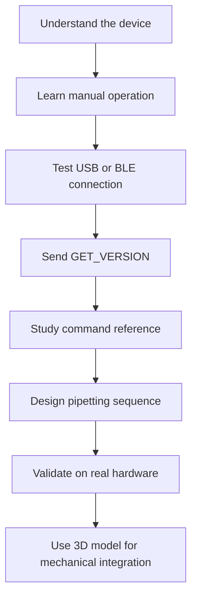
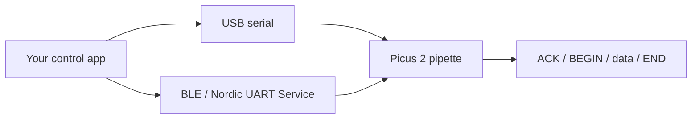
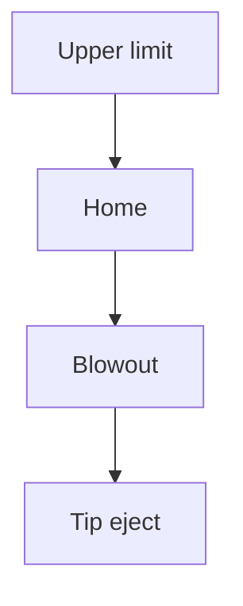
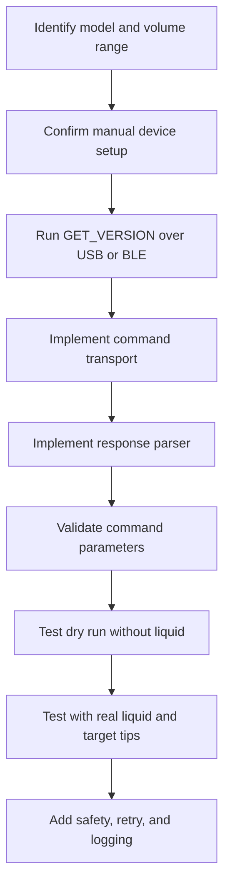

# Picus 2 Documentation Guide

This folder contains reference material for developing software or hardware integrations around the Sartorius Picus 2 electronic pipette. It is written for developers who are new to this pipette and need to understand the device, communication options, command interface, and practical pipetting workflow.

## Quick Start Path



## Document Map

| File | Use It For | Read When |
| --- | --- | --- |
| `Picus2_Product_Datasheet_EN.pdf` | Product capabilities, model ranges, channels, accuracy, Bluetooth support, pipetting modes | You need to choose or identify the target Picus 2 model |
| `Picus2_Operating_Instructions_KO.pdf` | Korean user manual covering buttons, menus, USB/Bluetooth settings, charging, maintenance, tips, filters | You need to understand how the physical device is operated |
| `Picus2_USB_Connection_Test_PowerShell.txt` | Minimal Windows USB serial test | You want the fastest possible connection check |
| `Picus2_BLE_Python_Connection_Guide.docx` | BLE setup guide using Python and `bleak` | You want to connect over Bluetooth |
| `Picus2_BLE_Example_Python_Script.zip` | Runnable BLE terminal-style Python example | You want starter code for command transmission |
| `Picus2_Command_Reference_Overview_20231031.pdf` | Command names, JSON formats, parameters, button events | You are implementing real control logic |
| `Picus2_Pipetting_Basics_Command_Interface.pdf` | Pipetting concepts and example command sequences | You are designing liquid-handling behavior |
| `Picus2_Command_Dispensing_Demo_Kornic.mp4` | Visual demonstration of command-driven dispensing | You need to compare software commands with physical motion |
| `Picus2_3D_Model_STEP.zip` | Mechanical STEP model | You are designing a mount, fixture, robot gripper, or enclosure |

## Communication Overview



Picus 2 can be controlled through USB serial or BLE using JSON-style commands. A good first test command is:

```json
{"data":"GET_VERSION"}
```

The USB example also shows this variant:

```json
{"no": 0, "data":"GET_VERSION"}
```

For BLE, the example script uses Nordic UART Service UUIDs:

| BLE Item | UUID |
| --- | --- |
| Service | `6E400001-B5A3-F393-E0A9-E50E24DCCA9E` |
| RX Characteristic | `6E400002-B5A3-F393-E0A9-E50E24DCCA9E` |
| TX Characteristic | `6E400003-B5A3-F393-E0A9-E50E24DCCA9E` |

## Recommended Reading Order

### 1. Product Datasheet

Start with `Picus2_Product_Datasheet_EN.pdf`.

This gives you the hardware boundary of the system: supported volume ranges, single-channel and multi-channel models, battery characteristics, Bluetooth availability, pipetting modes, memory slots, tip compatibility, and model-specific accuracy data.

As a developer, check the target model early. A command sequence that makes sense for a 1,000 uL model may not be valid for a 10 uL model.

### 2. Operating Instructions

Read `Picus2_Operating_Instructions_KO.pdf` to understand the actual device behavior.

Even if your goal is full automation, you still need to know the manual controls, menu structure, charging behavior, Bluetooth/USB settings, tip handling, filters, and maintenance requirements. This makes debugging much easier because you can compare command behavior with normal user operation.

### 3. USB Connection Test

Use `Picus2_USB_Connection_Test_PowerShell.txt` for a minimal USB smoke test on Windows.

The script checks available serial ports, opens a port such as `COM5` with `9600`, `None`, `8`, `one`, sends `GET_VERSION`, reads several response lines, and closes the port.

Before running it, replace `COM5` with the actual port returned by:

```powershell
[System.IO.Ports.SerialPort]::getportnames()
```

### 4. BLE Python Guide

Use `Picus2_BLE_Python_Connection_Guide.docx` when connecting over Bluetooth.

The guide uses Python and the `bleak` library. The expected device name format is similar to:

```text
Picus-12345678
```

After connection, the example sends JSON commands through a terminal-like interface and prints responses such as `ACK`, `BEGIN`, returned data, and `END`.

### 5. BLE Example Script

Open `Picus2_BLE_Example_Python_Script.zip`.

It contains:

```text
picus2_ble_example.py
```

This script scans for the pipette, connects through BLE, starts notifications, reads commands from standard input, and writes them to the RX characteristic. Use it as a starting point, then add production behavior such as structured response parsing, timeout handling, reconnect logic, logging, and command validation.

### 6. Command Reference

Use `Picus2_Command_Reference_Overview_20231031.pdf` as the source of truth for command names, JSON structures, and parameters.

The document includes button-event commands. For example:

```json
{"button": "TRIGGER_BUTTON_RIGHT"}
```

Button commands emulate physical button input and are described as not returning command results. For actual pipetting commands, always check the PDF for exact parameter order, limits, and expected behavior.

### 7. Pipetting Basics

Read `Picus2_Pipetting_Basics_Command_Interface.pdf` before designing liquid-handling logic.

The document explains key piston positions:



It also explains common pipetting strategies:

| Mode | Use Case | Typical Command Shape |
| --- | --- | --- |
| Forward pipetting | General calibrated transfer | Aspirate target volume, then dispense with blow-out |
| Reverse pipetting | Viscous, biological, foaming, or very small volumes | Aspirate target volume plus excess, dispense target volume, discard excess |
| Multi-dispensing | Repeated equal dispenses, plates, long series | Aspirate total volume plus excess, then run multiple dispense steps |

Example sequences from the document:

```text
Forward pipetting 500 uL
1. RUN_ASPIRATE 500 7
2. BLOW_OUT 1 7 3000

Reverse pipetting 500 uL
1. RUN_ASPIRATE 540 4
2. RUN_DISPENSE 500 4
3. BLOW_OUT 1 4 3000

Multi-dispensing 3 x 100 uL
1. RUN_ASPIRATE 360 4
2. RUN_DISPENSE 30 4
3. RUN_DISPENSE 100 4
4. RUN_DISPENSE 100 4
5. RUN_DISPENSE 100 4
6. BLOW_OUT 1 4 3000
```

## Development Checklist



Use this checklist when turning the documents into code:

- Confirm the exact Picus 2 model before choosing volume limits.
- Decide whether USB or BLE is the primary transport.
- Start with `GET_VERSION` before sending motion commands.
- Parse responses explicitly instead of assuming a single-line response.
- Treat pipetting as a sequence: aspirate, dispense, blow-out, return/prepare.
- Validate volume, speed, and mode before sending commands.
- Test first without liquid, then with safe volumes, then with real experimental conditions.
- Add handling for disconnects, delayed responses, user cancellation, and invalid device state.

## Mechanical And Visual References

Use `Picus2_Command_Dispensing_Demo_Kornic.mp4` to observe the timing and physical behavior of command-driven dispensing.

Use `Picus2_3D_Model_STEP.zip` when the pipette must be integrated with hardware. The ZIP contains:

```text
p2_10.stp
```

This model is useful for checking:

- Mount and holder geometry
- Robot end-effector clearance
- Camera or sensor placement
- Tip access and ejection clearance
- Charging or cable routing constraints

## Safety Notes

- Verify command sequences with an empty tip before using liquid.
- Start with small volumes and slow speeds.
- Keep the physical pipette visible during early tests.
- Do not rely only on software success responses; confirm the actual physical motion.
- Revalidate any sequence that affects experimental results under the real liquid, tip, and lab conditions.
